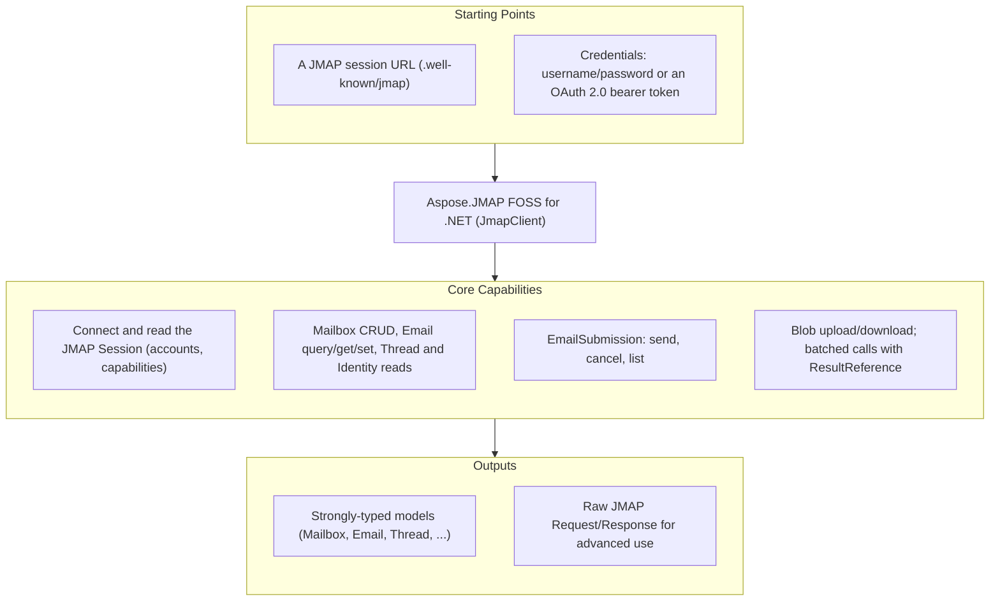

# Aspose.JMAP FOSS for .NET

[](LICENSE) [](https://www.nuget.org/packages/Aspose.JMAP.FOSS/) [](https://github.com/aspose-email-foss/Aspose.JMAP-FOSS-for-.NET/graphs/contributors)

[](https://products.aspose.org/jmap/net/)

Aspose.JMAP FOSS for .NET is a free, open source JMAP client library for .NET — a C# toolkit for
talking to a [JMAP](https://jmap.io) mail server over HTTP: [RFC 8620](https://www.rfc-editor.org/rfc/rfc8620)
Core (session, `Core/echo`, blob upload/download, batched method calls) and
[RFC 8621](https://www.rfc-editor.org/rfc/rfc8621) Mail (Mailbox/Email/Thread/Identity/SearchSnippet)
plus EmailSubmission. Its public API is styled after Aspose.Email's client conventions — a client
object plus an options object, `using`-scoped disposal, and strongly-typed message and folder
models — and it ships with no required third-party package dependencies.

**This is an official Aspose open-source project. It does not contain or reference Aspose.Email
proprietary source.** The library is generated from hand-authored JMAP protocol specifications.

## Navigation

- [At a Glance](#at-a-glance)
- [Key Capabilities](#key-capabilities)
- [Installation](#installation)
- [Dependencies](#dependencies)
- [Quick Start](#quick-start)
- [Additional Examples](#additional-examples)
- [API Reference](#api-reference)
- [Documentation & Resources](#documentation--resources)
- [Scope and Limitations](#scope-and-limitations)
- [Development and Testing](#development-and-testing)
- [License](#license)

## At a Glance



## Key Capabilities

- **Connect and inspect the session** — `JmapClient.ConnectAsync()` fetches
  `/.well-known/jmap` and exposes the `Session` (account ids, `capabilities`, `apiUrl`,
  `uploadUrl`, `downloadUrl`).
- **Mailboxes** — `ListMailboxesAsync()`, `GetMailboxAsync()`, `CreateMailboxAsync()`,
  `DeleteMailboxAsync()` wrap `Mailbox/get`, `Mailbox/query`, and `Mailbox/set`.
- **Messages** — `ListMessagesAsync()`, `FetchMessageAsync()`, `MoveMessageAsync()`,
  `SetMessageKeywordAsync()`, `DeleteMessageAsync()` over `Email/query`, `Email/get`, and
  `Email/set`.
- **Identities** — `ListIdentitiesAsync()` over `Identity/get`.
- **Sending** — `SendAsync()`, `CancelSendAsync()`, `ListSubmissionsAsync()` wrap
  `EmailSubmission/set` and `EmailSubmission/get`.
- **Blobs** — `UploadBlobAsync()` / `DownloadBlobAsync()` for `/upload` and `/download`.
- **Batching** — `SendRequestAsync()` sends any list of `Invocation`s in one HTTP round trip,
  with `ResultReference` ([RFC 8620 §3.7](https://www.rfc-editor.org/rfc/rfc8620#section-3.7))
  to chain one call's result into the next.
- **Pluggable transport** — the client depends on `IJmapTransport`, not `HttpClient` directly;
  every unit test injects a fake transport, so no test needs a network.
- **OAuth 2.0** — `JmapClientOptions.BearerToken` ([RFC 6750](https://www.rfc-editor.org/rfc/rfc6750))
  as an alternative to HTTP Basic.

## Installation

No package has been published to NuGet yet; until it is, build the library from source (see
[Development and Testing](#development-and-testing)). The intended published id is
`Aspose.JMAP.FOSS`:

```bash
dotnet add package Aspose.JMAP.FOSS
```

Or add it directly to a project file:

```xml
<PackageReference Include="Aspose.JMAP.FOSS" Version="0.1.0" />
```

The library targets .NET 8.0 and runs on Windows, Linux, and macOS.

## Dependencies

### Required Package Dependencies

None. JSON handling uses `System.Text.Json` from the base-class library; there are zero
`<PackageReference>` entries in the library project.

### Native and System Requirements

- The .NET 8.0 SDK (or later) to build, and the matching .NET 8.0 runtime (or later) to run.

### Development Dependencies

- `Microsoft.NET.Test.Sdk`, `xunit`, and `xunit.runner.visualstudio` — the xUnit test host and
  adapter, used only by `tests/Aspose.Jmap.Tests`. They are never referenced by the library
  project and are not shipped with the package.

## Quick Start

```csharp
using Aspose.Jmap;

var options = new JmapClientOptions
{
    SessionUrl = new Uri("https://jmap.example.test/.well-known/jmap"),
    Username = "user@example.test",
    Password = "secret",
};

using var client = new JmapClient(options);
await client.ConnectAsync();

IReadOnlyList<Mailbox> mailboxes = await client.ListMailboxesAsync();
```

## Additional Examples

### OAuth 2.0 bearer token authentication

As an alternative to HTTP Basic authentication (`Username`/`Password`), authenticate with an
OAuth 2.0 bearer token ([RFC 6750](https://www.rfc-editor.org/rfc/rfc6750)) by setting
`BearerToken`. When set, it takes precedence and every request is sent with
`Authorization: Bearer <token>`:

```csharp
var options = new JmapClientOptions
{
    SessionUrl = new Uri("https://jmap.example.test/.well-known/jmap"),
    BearerToken = "eyJhbGciOi...", // e.g. obtained via an OAuth 2.0 flow
};

using var client = new JmapClient(options);
await client.ConnectAsync();
```

<details>
<summary>Batching requests with ResultReference</summary>

Multiple method calls can be batched into a single HTTP round trip via `SendRequestAsync`, using
a `ResultReference` ([RFC 8620 §3.7](https://www.rfc-editor.org/rfc/rfc8620#section-3.7)) to
chain a later call to an earlier one's result without a second request:

```csharp
var query = new Invocation
{
    Name = "Email/query",
    Arguments = new Dictionary<string, object> { ["accountId"] = accountId },
    MethodCallId = "c1",
};
var get = new Invocation
{
    Name = "Email/get",
    Arguments = new Dictionary<string, object>
    {
        ["accountId"] = accountId,
        ["#ids"] = new ResultReference { ResultOf = "c1", Name = "Email/query", Path = "/ids" },
    },
    MethodCallId = "c2",
};
var resp = await client.SendRequestAsync(new[] { query, get }, new[] { "urn:ietf:params:jmap:mail" });
```

</details>

## API Reference

`JmapClient` (with `JmapClientOptions`) is the single entry point; the model classes
`Session`, `Mailbox`, `Email`, `EmailAddress`, `Thread`, `Identity`, `EmailSubmission`, and
`SearchSnippet` mirror the JMAP objects one-to-one, and `Invocation` / `ResultReference` model
raw method calls for `SendRequestAsync`. Errors surface as `JmapNetworkException` (transport)
and `JmapProtocolException` (a JMAP method-level error); per-item `Set` failures are returned as
data on the result object rather than thrown.

The full protocol/API reference, rendered from the same specs that drive generation, is
[`docs/api-reference.md`](../../docs/api-reference.md) at the repository root.

## Documentation & Resources

- **[Getting started guide](https://docs.aspose.org/jmap/net/)** — installation and walkthroughs.
- **[API reference](https://reference.aspose.org/jmap/net/)** — browsable reference for the public types.
- **[How-to guides & FAQ](https://kb.aspose.org/jmap/net/)** — task-focused answers.
- **[Protocol/API reference](../../docs/api-reference.md)** — the in-repo reference rendered from the specs.
- **[Changelog](../../CHANGELOG.md)**, **[Contributing guide](../../CONTRIBUTING.md)**, **[Security policy](../../SECURITY.md)**.
- Found a bug or have a feature request? [Open an issue](https://github.com/aspose-email-foss/Aspose.JMAP-FOSS-for-.NET/issues) on GitHub.

## Scope and Limitations

- **Protocol**: JMAP Core (RFC 8620) and JMAP Mail (RFC 8621: Mailbox/Email/Thread/Identity/SearchSnippet)
  plus EmailSubmission.
- **Out of scope for v1**:
  - Push / `EventSource` streaming — the type exists but is a stub/no-op.
  - JMAP for Calendars and Contacts.
  - `Date`/`UTCDate` values are kept as raw RFC 3339 strings (no `DateTimeOffset` parsing) to
    avoid timezone-conversion bugs.
- Unit tests run against an injectable transport with mocked responses — no live JMAP server is
  required. A Docker-based live-server integration suite (Stalwart Mail Server) lives in
  [`infra/integration/`](../../infra/integration/README.md).

## Development and Testing

```bash
git clone https://github.com/aspose-email-foss/Aspose.JMAP-FOSS-for-.NET.git
cd Aspose.JMAP-FOSS-for-.NET
dotnet build src/Aspose.Jmap/Aspose.Jmap.csproj
dotnet test tests/Aspose.Jmap.Tests/Aspose.Jmap.Tests.csproj
```

See [`infra/integration/README.md`](../../infra/integration/README.md) for the live-server suite.

## License

This project is licensed under the [MIT License](LICENSE). The MIT License permits use, copying,
modification, distribution, sublicensing, and commercial use, provided its copyright and
permission notice are retained. The software is provided without warranty.
